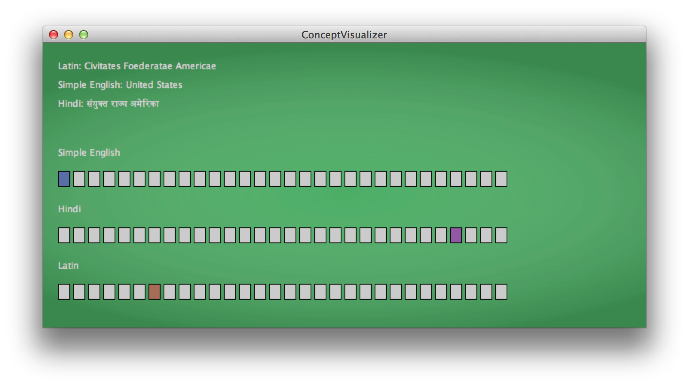

Wikipedia Concept Visualizer
===
Implemented portions of a concept visualizer for Wikipedia that identifies the most popularWikipedia articles in each language and then shows the correlation of that concept between languages. 

The finished program looks like this. 

In this visualization, each row of boxes represents the most popular Wikipedia articles in a particular language (Simple English, Hindi, Latin).
The user of this visualization is hovering their cursor over the Hindi article for "United States", and it is highlighted in purple.
The visualization has highlighted the corresponding articles in Simple English (blue), and Latin (orange).

The program relies on the [wikAPIdia software library](https://github.com/shilad/wikAPIdia)
developed by Shilad, Rebecca, [Brent Hecht](http://www.brenthecht.com/), and many others.